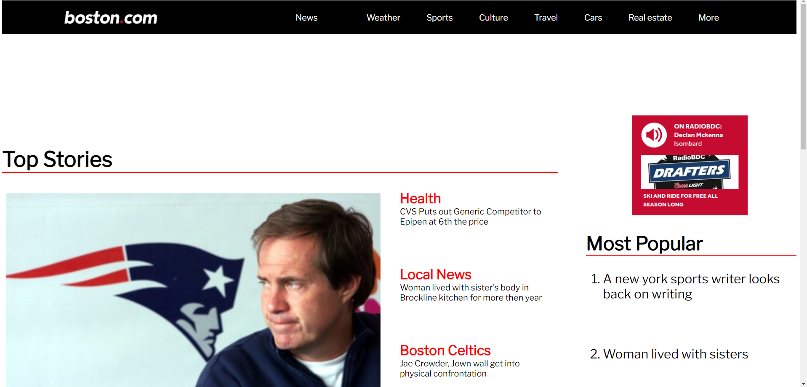

# Boston.com
My Attempt at making Boston.com

#### This was a recreation of Boston.com using floats reinforcing my skills

## How it's Made:
Tech used: HTML, CSS 

I used HTML & CSS to make a recreation of the site 

## Optimizations
I'd like to go back and redo the site using flexbox 

## Lessons Learned
I learned alot from making this site such as how margin affects the sides of a side to spacing content alot better

## Example
Take a look at this example that i have below.

